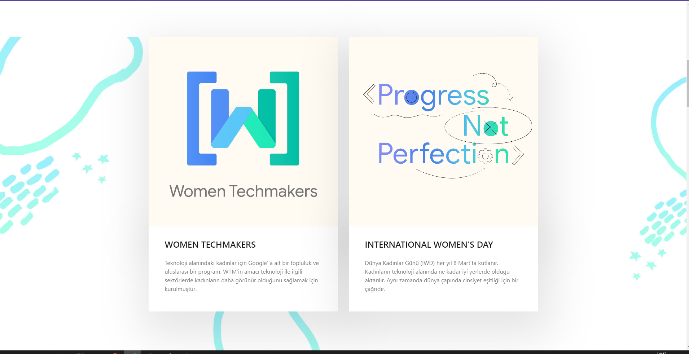

# IWD Event

We organized the IWD event we organize every year online this year due to the pandemic. I developed the website for this event.
The purpose of this site was to promote the event, to present the participation form to the users for in-person events.

# What Technologies Did I Use?

* HTML-CSS
* Bootstrap 
* Js

**[You can visit this software to review the entire website.](http://wtmturkey.cf/)**

# Event images

---------------- 

--------------------

